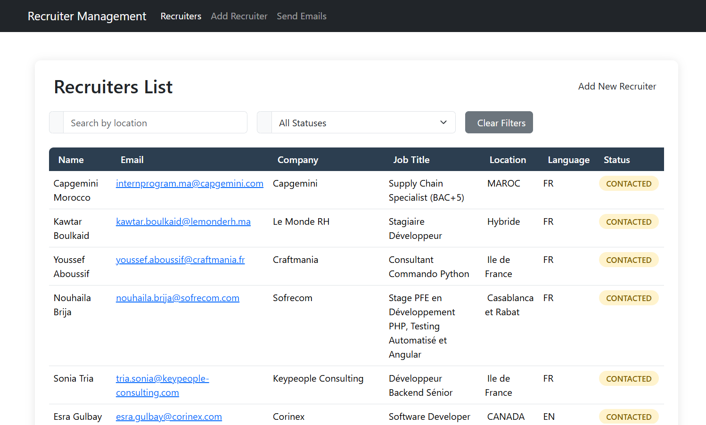
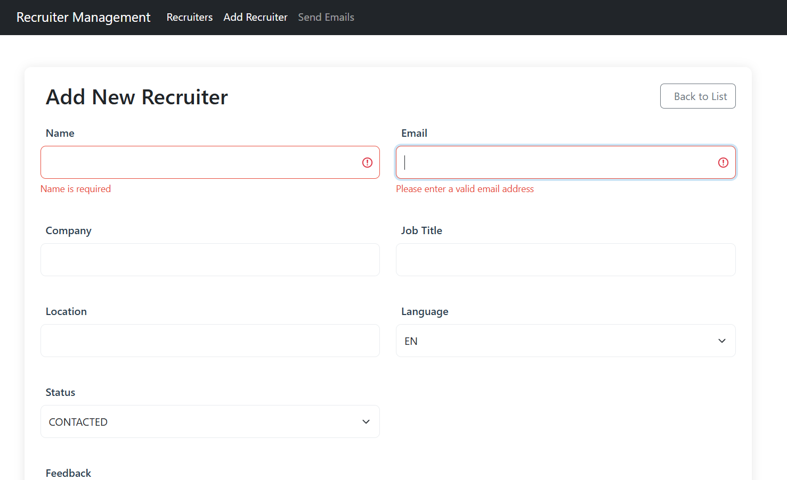
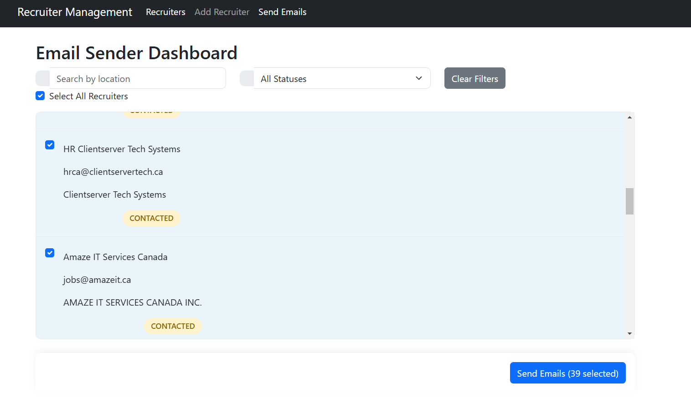

# 🚀 Job Application Tracker - Frontend

  
*Manage recruiters, track applications, and send emails seamlessly!*

---

## 📝 **Description**
This project is a **Job Application Tracker** designed to help you manage recruiters efficiently. You can:
- Add recruiters to the database with a validated form.
- View, filter, and search recruiters by status or location.
- Edit or delete recruiter details.
- Send emails to recruiters individually or in bulk.

---

## 🖼️ **Screenshots**

### 1. Recruiter List
  
*View all recruiters, filter by status, search by location, and perform actions like edit or delete.*

### 2. Add Recruiter Form
  
*Add new recruiters with a user-friendly form that includes field validation.*

### 3. Send Email Interface
  
*Select recruiters and send emails individually or in bulk with a single click.*

---

## 🛠️ **Technologies Used**
- **Frontend**: React.js, TailwindCSS  
- **State Management**: Redux or Context API (if applicable)  
- **Form Handling**: React Hook Form or Formik  
- **Validation**: Yup or custom validators  
- **Email Integration**: Nodemailer or third-party API (via backend)  
- **Hosting**: Vercel  

---

## 🚀 **Live Preview**
Check out the live version of the project hosted on Vercel:  
👉 [Live Preview](https://your-vercel-link-here.com)

---

## 🔗 **Backend Link**
The backend for this project is hosted on AWS and uses Docker and Jenkins for deployment. Check out the backend repository here:  
👉 [Backend Repository](https://github.com/your-username/backend-repo)

---

## 📝 **How to Run the Project**
# Step 1: Clone the repository
git clone https://github.com/your-username/car-rental-project.git

# Step 2: Navigate to the project directory
cd car-rental-project

# Step 3: Install dependencies
npm install

# Step 4: Run the development server
ng serve

# Step 5: Open your browser and visit the application
echo "Open your browser and visit: http://localhost:4200/"

## 📄 **License**
This project is licensed under the MIT License. See the [LICENSE](LICENSE) file for details.

---

## 🔧 **Badges**
  
  

